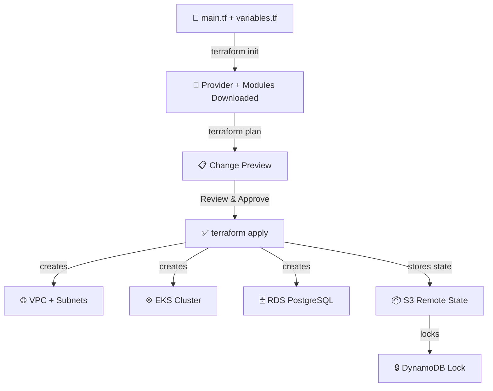

# 🏗️ Terraform Architect
> **Automate multi-tier environment setups. Provision VPC layers, server infrastructure scales, and bucket access configurations dynamically in HCL syntax.**

[](https://pradeeptalari14.github.io/portfolio/tools/terraform/)
[]()

---

## 🎛️ Studio Options — What the UI Generates

The studio has multiple configurable options. Each combination produces different output files.
This repository contains **one working example per option variant** so you can learn by diffing.

### Output Tabs (files the studio generates)
| Tab | Description |
|-----|-------------|
| `main.tf` | Generated in studio Output tab |
| `variables.tf` | Generated in studio Output tab |
| `outputs.tf` | Generated in studio Output tab |
| `apply.sh` | Generated in studio Output tab |
| `Flow Diagram` | Generated in studio Output tab |

### Configurable Options
| Option | Available Values |
|--------|-----------------|
| **Cloud Provider** | `AWS` / `GCP` / `Azure` |
| **Resources** | `VPC + EKS` / `VPC + RDS` / `S3 + CloudFront` / `EC2 + ALB` |
| **Environment** | `dev` / `staging` / `prod` |
| **Remote State** | `S3 + DynamoDB` / `GCS` / `Azure Blob` |

---

## 🏗️ Architecture Flow Diagram




---

## 📁 Repository Structure

```
tp-terraform/
├── README.md          ← This file — complete learning guide
├── examples/aws-vpc-eks/main.tf
├── examples/aws-vpc-rds/main.tf
├── variables.tf
├── outputs.tf
├── scripts/apply.sh
├── scripts/           ← Deployment + validation helpers
└── docs/USAGE.md      ← Extended usage guide
```

---

## ⚡ Quick Start

### Step 1 — Generate files from the Studio
1. Open **[Terraform Architect Studio](https://pradeeptalari14.github.io/portfolio/tools/terraform/)**
2. Select your option values in the UI
3. Watch the output update live in the editor
4. Click **Download** or **Copy** for each tab

### Step 2 — Use the example files in this repo
```bash
git clone https://github.com/Pradeeptalari14/tp-terraform.git
cd tp-terraform
# Browse examples/ to find the variant matching your needs
# Copy the relevant files into your project
```

---

## 🔄 Complete Start-to-End Workflow


---

## 📖 How Each Option Changes the Output

### Cloud Provider
- **`AWS`** — see `examples/` folder for generated output
- **`GCP`** — see `examples/` folder for generated output
- **`Azure`** — see `examples/` folder for generated output

### Resources
- **`VPC + EKS`** — see `examples/` folder for generated output
- **`VPC + RDS`** — see `examples/` folder for generated output
- **`S3 + CloudFront`** — see `examples/` folder for generated output
- **`EC2 + ALB`** — see `examples/` folder for generated output

### Environment
- **`dev`** — see `examples/` folder for generated output
- **`staging`** — see `examples/` folder for generated output
- **`prod`** — see `examples/` folder for generated output

### Remote State
- **`S3 + DynamoDB`** — see `examples/` folder for generated output
- **`GCS`** — see `examples/` folder for generated output
- **`Azure Blob`** — see `examples/` folder for generated output

---

## 💡 SRE Compliance & Best Practices

| SRE Compliance Pillar | ❌ Anti-Pattern | ✅ Production Best Practice |
|---|---|---|
| **Secrets Protection** | Committing passwords or dynamic tokens to repositories | Exclude sensitive files in `.gitignore` and reference Vault parameters |
| **Deployment Auditing** | Manual ad-hoc server updates | Enforce infrastructure validation and continuous deployment pipelines |

## 🔐 Security Standards

- ❌ Never commit credentials, API keys, or database passwords directly to Git repositories.
- ✅ Reference dynamic parameters using cloud Secret Managers (Vault, AWS SSM Parameter Store, Key Vault).
- ✅ Enforce branch protection rules: require peer pull request reviews and green status checks.

---

## 📖 Resources

| Resource | Link |
|----------|------|
| Interactive Studio | [Open →](https://pradeeptalari14.github.io/portfolio/tools/terraform/) |
| All 91 Studios | [Dashboard →](https://pradeeptalari14.github.io/portfolio/tools/) |
| SRE Provisioning Guide | [Handbook →](https://github.com/Pradeeptalari14/portfolio/blob/main/GITHUB_PROVISIONING_GUIDE.md) |

---
*Generated by [Terraform Architect Studio](https://pradeeptalari14.github.io/portfolio/tools/terraform/) — [Talari Pradeep Portfolio](https://pradeeptalari14.github.io/portfolio)*